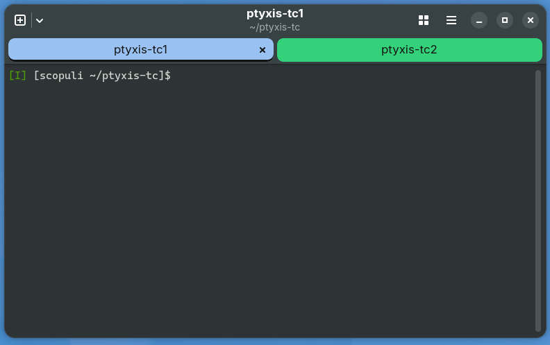

# Ptyxis-TC

An unofficial [Ptyxis](https://gitlab.gnome.org/chergert/ptyxis) fork with
hostname-based tab colors, manual tab colors, and right-click copy/paste.



## Project status and disclaimer

Ptyxis-TC was created for personal use and is shared as-is. No additional
features are planned. The RPM and DEB packages are provided for convenience.

There is no fixed maintenance or release schedule. Updates to this fork and
its packages will not necessarily follow releases of upstream Ptyxis, and
upstream bug fixes or security fixes may not be included promptly, or at all.
Support and continued compatibility with future distribution or library
versions are not guaranteed.

This is an unofficial project and is not affiliated with or endorsed by the
upstream Ptyxis developers. It is provided without warranty, as described in
the GNU General Public License; see [COPYING](COPYING).

## Features

- Automatic tab background colors based on hostnames and SSH aliases.
- Manual tab colors through the tab context menu.
- Manual colors retained during session restoration.
- Right-click copies selected text and clears the selection; with no selection, it pastes.
- Shift+right-click opens the original terminal context menu.
- Separate application ID and settings, so it can coexist with Fedora's regular Ptyxis.

Custom changes started on Ptyxis 50.1. The `main` branch preserves both the
custom changes and newer upstream history, currently reporting version 50.2.

## Build on Fedora

Clone the repository:

```bash
git clone git@github.com:greenfinch628/ptyxis-tc.git
cd ptyxis-tc
```

Install build dependencies:

```bash
sudo dnf install meson ninja-build gcc gettext-devel glib2-devel gtk4-devel \
  libadwaita-devel vte291-gtk4-devel json-glib-devel libportal-devel \
  libportal-gtk4-devel desktop-file-utils
```

Configure, build, and run the upstream checks:

```bash
meson setup build-tc --prefix=/opt/ptyxis-tab-colors-50.1 \
  --buildtype=debugoptimized \
  -Dapp-id=org.gnome.Ptyxis.TabColors \
  -Dgschema-id=org.gnome.Ptyxis.TabColors \
  -Dgschema-path=/org/gnome/Ptyxis/TabColors/
meson compile -C build-tc
meson test -C build-tc --print-errorlogs
```

The installation prefix retains its original `50.1` name for compatibility
with existing launchers. See [custom/README.md](custom/README.md) for source
installation, dependency versions, configuration, and compatibility details.

## Ubuntu 26.04 package

The validated Ubuntu 26.04 amd64 DEB is available in
[packages/ubuntu-26.04/](packages/ubuntu-26.04/) and through
[GitHub Releases](https://github.com/greenfinch628/ptyxis-tc/releases).
To install the package from this checkout:

```bash
sudo apt install ./packages/ubuntu-26.04/ptyxis-tc_50.2-1ubuntu26.04.1_amd64.deb
```

APT resolves the required Ubuntu dependencies. Ubuntu 24.04's stock
libadwaita and VTE libraries do not meet this version's requirements.
Close and reopen Ptyxis-TC after installation or upgrading. Launch it with
`ptyxis-tc`, `ptyxis-tab-colors`, or the Ptyxis-TC application menu entry.
The package preserves the separate application ID and settings.

Verify the package from the repository root:

```bash
(cd packages/ubuntu-26.04 && sha256sum -c SHA256SUMS)
```

Matching Debian source files and the Ubuntu build report are available on
the release page. The package was built from commit
`3f30ed408067e9303c7316c3e8e54333407b8853`.

## Local RPM on Scopuli

The locally built Fedora 44 x86_64 package is stored under `local-rpm/`.
RPM artifacts and build inputs in that directory are excluded from Git and
are not included in a fresh clone.

```bash
sudo dnf install ~/ptyxis-tc/local-rpm/RPMS/x86_64/ptyxis-tc-50.2-1.fc44.x86_64.rpm
```

Close and reopen Ptyxis-TC after upgrading. Launch it from the application
menu or run `ptyxis-tc` (also available as `ptyxis-tab-colors`).
The local `local-rpm/README.md` contains RPM rebuild instructions.

## Hostname colors

Create or edit `~/.config/org.gnome.Ptyxis.TabColors/tab-colors.ini`.
Use [custom/tab-colors.ini](custom/tab-colors.ini) as an example and replace
its hosts and aliases with your own. Changes are read automatically.

This source reads the user configuration file; the legacy RPM configuration
at `/etc/ptyxis-tc/tab-colors.ini` is not read. Copy any desired mappings from
that file into your user configuration.

## Validation and compatibility

The current source built successfully on Scopuli (Fedora 44 x86_64) with
GTK 4.22.5, libadwaita 1.9.4, and VTE 0.84.1. All four Meson checks and the
custom tab-color integration test passed. The local RPM also passed digest
verification and an upgrade dry run.

Tab styling uses libadwaita internals and deprecated GTK style APIs, so other
library versions require verification. See
[custom/ARCHIVE-NOTES.md](custom/ARCHIVE-NOTES.md) for the original build and
validation history.

## License and attribution

Licensed under GPL version 3 or later; see [COPYING](COPYING).
Original copyright and license notices are retained.

Ptyxis is developed upstream by Christian Hergert and contributors.
Modified by Bob Czys, October 5, 2026.
The original upstream README is preserved in [README-upstream.md](README-upstream.md).
